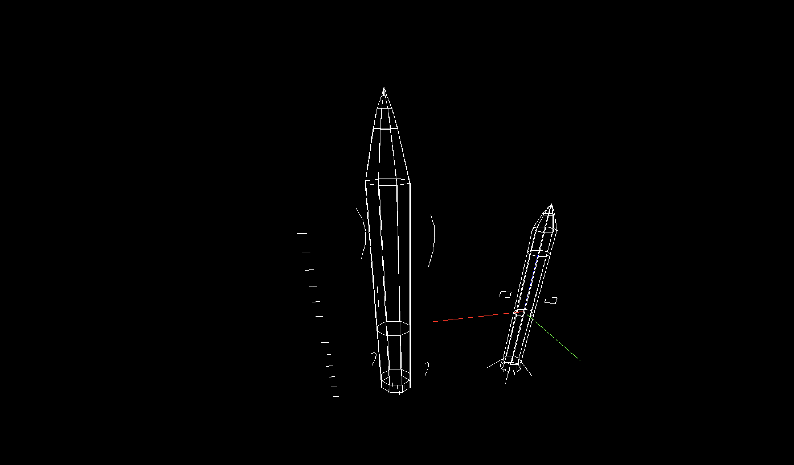

# 3D Computer Graphics project
Implementation of algorithms for 3D graphics with different 3D scenes and moveable camera.
Each object can be moved and animated.

## Shortcuts for control
- **A W S D** - camera movement
- **shift** - camera up movement
- **control** - camera down movement
- **E and R** - rotation of object
- **arrows** - movement of object by X and Y axis
- **R** - up scaling of object
- **F** - down scaling of object
- **Y** - selection of edited object
- **I** - automatic rotation of selected object
- **X** - change of scene
- **V** - change of type of view
- **Z** - divides cubic into more lines
- **U** - divides cubic into fewer lines
